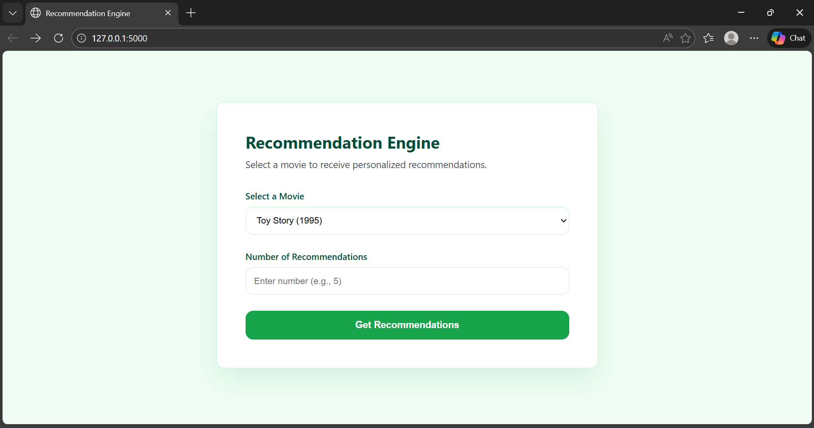
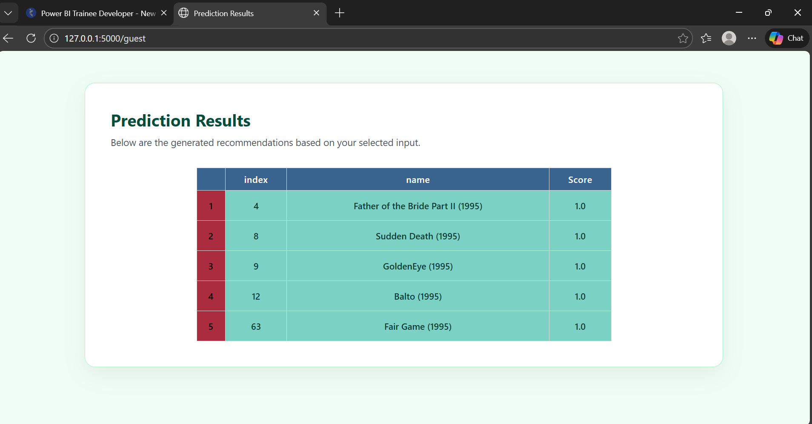

# Movie Recommendation System

This project is a content-based recommendation system that suggests movies
based on similarity between movie descriptions. The system is built using
Machine Learning techniques and deployed as a Flask web application.

## Project Overview
The recommendation engine uses TF-IDF vectorization and cosine similarity
to find movies similar to a given input movie. The backend is developed
using Flask, and movie data is stored in a MySQL database.

## Features
- Content-based movie recommendations
- TF-IDF and cosine similarity for similarity calculation
- Flask REST API
- MySQL database integration
- Scalable and easy to extend

## Tech Stack
- Python
- Flask
- Pandas
- Scikit-learn
- MySQL
- SQLAlchemy
- PyMySQL

## Dataset
The dataset contains movie details such as title, genre, and description.
Data is stored in a MySQL database table.

## How It Works
1. Movie data is fetched from the MySQL database
2. Text data is vectorized using TF-IDF
3. Cosine similarity is calculated between movies
4. Top similar movies are returned as recommendations

## How to Run the Project
1. Clone the repository  
   `git clone https://github.com/your-username/movie-recommendation-system`

2. Create and activate conda environment  
   `conda create -n ml_env python=3.9`  
   `conda activate ml_env`

3. Install required packages  
   `pip install -r requirements.txt`

4. Configure MySQL database credentials in the Python file

5. Run the Flask application  
   `python New_Recommender_flaskapp.py`

6. Open browser and access the API  
   `http://127.0.0.1:5000`

## Future Enhancements
- Add collaborative filtering
- Improve UI using HTML/CSS
- Add user authentication
- Deploy using Docker or cloud services

## Author
Ari

